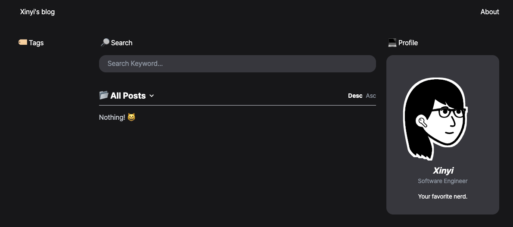

# Xinyi's Blog

This repo is forked from [morethan-log](https://github.com/morethanmin/morethan-log), which was originally deployed on Vercel. I made some slight changes and deployed this repo on GitHub Pages. I mean, I'm a poor developer who can't even afford my own domain name. But hey, I'm still rocking it!

[Xinyi's Blog](https://xinyiiiwang.github.io/Xinyi-blog)

## Features

**📒 Writing posts using notion**

- No need to commit to Github for posting anything to your website.
- Posts created on Notion are automatically updated on your site.

**📄 Use as a page as resume**

- Useful for generating full page sites using Notion.
- Can be used for Resume, Portfolios etc.

**👀 SEO friendly**

- Dynamically generates OG IMAGEs (thumbnails!) for posts. ([og-image-korean](https://github.com/morethanmin/og-image-korean)).
- Dynamically creates sitemap for posts.

**🤖 Customisable and Supports various plugin through CONFIG**

- Your profile information can be updated through Config. (`site.config.js`)
- Plugins support includes, Google Analytics, Search Console and also Commenting using Github Issues(Utterances) or Cusdis.

## Contribution

You can find all of the information in original repo.

## License

The [MIT License](LICENSE).
